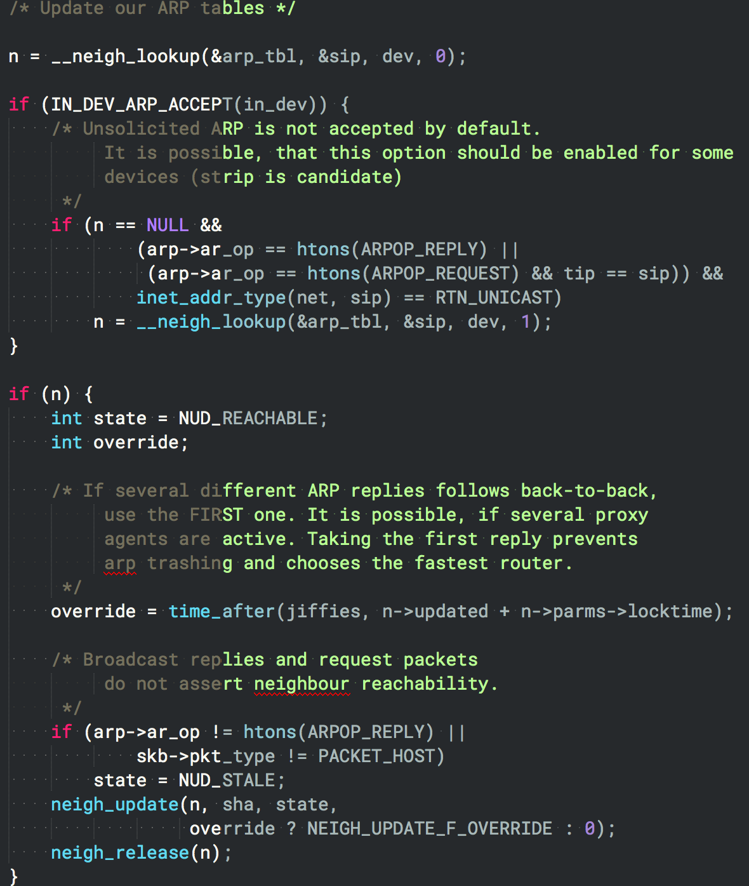

# literate-themes

A collection of `.tmTheme` color themes generated with [literate-theme](https://github.com/rileyjshaw/literate-theme).

This repo won't be updated as frequently as the source themes are, so it's
probably best to just [re-generate them yourself](https://github.com/rileyjshaw/literate-theme) :)

## License
[MIT](./LICENSE)
